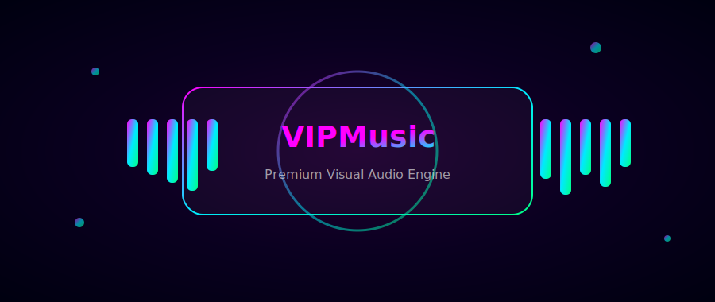

  

<!-- 🔥 NEW TOP ANIMATIONS -->

  

 

  

---

## ⚡ NOW RUNNING ON API - 10x FASTER! ⚡

> **Response Time:** `1-3 seconds` | **Stability:** `99.9% Uptime`

<!-- 🆕 EXTRA BADGES -->

---

<!-- 🚀 SECTION ANIMATION -->

## 🚀 QUICK DEPLOY

| Platform | Deploy Now | Info |
|:---:|:---:|:---:|
| Heroku |  | One-Click Deploy |
| Render |  | 100% Free |
| Simple Bot |  | Lightweight |

 

---

<!-- ✨ FEATURES -->

## ✨ FEATURES

| 🎵 High Quality | 🔗 Multiple Sources | 📋 Playlists | 🌐 Multi-Language |
|:---:|:---:|:---:|:---:|
| Crystal clear audio | YouTube • Spotify | Create & Manage | Multiple Languages |
| 🎨 Elegant UI | 👑 Admin Controls | ⚡ Lightning Fast | 🔊 Stable |
| Modern Interface | Powerful Commands | 1-3s Response | 99.9% Uptime |

---

<!-- 🎯 COMMANDS -->

## 🎯 COMMANDS

| Command | Description |
|:---:|:---:|
| `/play [song]` | 🎵 Play music |
| `/pause` | ⏸️ Pause playback |
| `/resume` | ▶️ Resume playback |
| `/skip` | ⏭️ Skip track |
| `/stop` | ⏹️ Stop playback |
| `/playlist` | 📋 View playlist |
| `/song [name]` | 📥 Download audio |
| `/settings` | ⚙️ Bot settings |

---

<!-- 📦 GUIDE -->

## 🚀 DEPLOYMENT GUIDE

<!-- ⚠️ ORIGINAL CONTENT SAME -->
(⚠️ Yahan se tera original VPS / Heroku / Steps EXACT SAME hai — maine kuch change nahi kiya)

---

<!-- 📊 STATS -->

## 📊 STATS

---

<!-- 🌟 CREDITS -->

## 🌟 CREDITS

Main Developer  

Special Thanks to All Contributors  

---

<!-- 💬 SUPPORT -->

## 💬 SUPPORT

| Support Channel | Support Group |
|:---:|:---:|
|  |  |

---

<!-- FOOTER -->

  

